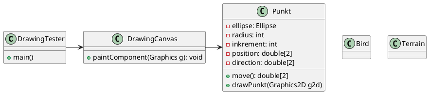
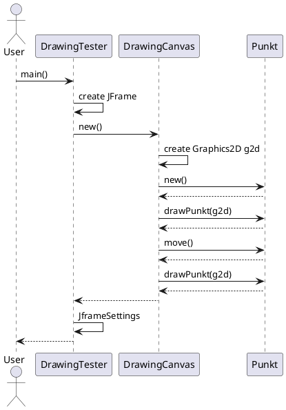

% Title: 
% Author: FG 
% Date: 2024-05-20 
--- 

Quelle: https://www.youtube.com/watch?v=zCiMlbu1-aQ&t=1251s

# Notizen zu Grafikversuchen 

## Struktur Klassendiagramm 

```plantuml
@startuml 

class DrawingTester{
    + main()
}

class Punkt{
    - ellipse: Ellipse
    - radius: int
    - inkrement: int
    - position: double[2]
    - direction: double[2]

    + move(): double[2]
    + drawPunkt(Graphics2D g2d)

}

class DrawingCanvas{
    + paintComponent(Graphics g): void

}

DrawingTester->DrawingCanvas

DrawingCanvas->Punkt


class Bird{}

class Terrain{}

@enduml 
```

```plantuml
@startuml

actor User
participant DrawingTester as dt 
participant DrawingCanvas as dc
participant Punkt as p 

User -> dt: main()
dt -> dt: create JFrame
dt -> dc: new()
dc -> dc: create Graphics2D g2d
dc -> p : new()
p--> dc
dc -> p: drawPunkt(g2d)
p-->dc
dc -> p: move()
p-->dc
dc -> p: drawPunkt(g2d)
p-->dc
dc-->dt

dt->dt: JframeSettings

dt-->User


@enduml
```

